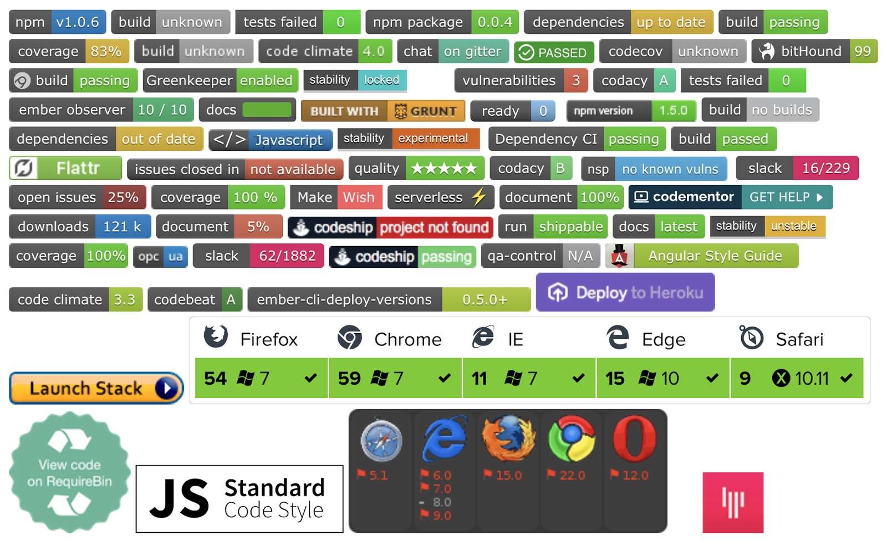

```{r set-options, cache=FALSE, include=FALSE}
options(width = 100)
```

```{r include=FALSE}
# Load all scripts from /src
if(!file.exists("../AppendixImage.RData")) {
	print("Loading up-to-dateness models...")
	source("freshness.R")
	source("ts.freshness.R")

	print("Loading popularity models...")
	source("downloads.R")
	source("ts.downloads.R")

	print("Loading test suite size models...")
	source("tests.R")
	source("ts.tests.R")

	print("Loading contribution quality models...")
	source("prtests.R")
	source("ts.prtests.R")

	print("Loading supporting models...")
	source("issue_closings.R")
	source("ts.issue_closings.R")
} else if(!already_loaded) {
	print("Loading from image...")
	load("../AppendixImage.RData")
}
```

```{r include=FALSE}
# Load functions for model printing
require(car)
require(grid)
require(pander)
require(MuMIn)
require(stargazer)
require(effects)
require(effsize)
source("util.R")
```

```{r global_options, include=FALSE}
knitr::opts_chunk$set(echo = FALSE, error=TRUE)
```

# Foreword

Listed below are the models and survey questions used for the study.
Effect plots are provided to assist in the interpretation
of the longitudinal models.

The tables were created using the R package *stargazer* by Marek Hlavac.\footnote{https://cran.r-project.org/web/packages/stargazer/vignettes/stargazer.pdf}

Our data set and R source code, used for the paper and to generate this appendix,
is publicly available.\footnote{https://somewhere}

\newpage


# Signals of Updated Dependencies

## Freshness Scores

Given a list of releases for a *single* dependency, such as

(1.0.0, 1.0.1, 1.2.1, 2.0.1-alpha, 2.0.2)

we define the *freshness* to be a weighted distance from the current version to the newest version.

For example, if the current version is given by the package as 1.0.x, then the maximum version 
matching this in the list above is 1.0.1. Hence we are

1.0.1 $\Rightarrow$ 1.2.1: one minor version (5 points)

1.2.1 $\Rightarrow$ 2.0.1-alpha: one major version (20 points)

2.0.1-alpha $\Rightarrow$ 2.0.2: one patch version (1 point)

= 26 points away from the latest version.

To handle the version strings used in package.json files, we use the *npm* packages *semver* and *semver-diff*. This allows us to find, for example, the latest release fulfulling a given version string. *semver* is used by *npm* itself.

We recognize that there are different "newest releases" depending on the time.
To solve this, we created a database of releases for all *npm* packages and only considered those that occured before
the time under consideration.

The per-project freshness scores in the paper are averaged over all of the project's dependencies.

```{r, results='asis'}
r.ts.fresh = r.squaredGLMM(mod.ts.fresh)

stargazer(mod.fresh.base, mod.fresh.badges, mod.fresh.base.hurdle, mod.fresh.badge.hurdle, mod.ts.fresh,
title="Dependency ``freshness'' (1-4) at the time of study and (5) per month",
column.labels=c("Base Model", "Full Model", "Base Model", "Full Model", "RDD"),
report="vc*",
#report="vc*s",
#font.size="tiny",
single.row=TRUE,
omit.stat = c("all"),
add.lines=list(
	c("AIC", 
		format(AIC(mod.fresh.base), digits = 3),
		format(AIC(mod.fresh.badges), digits = 3),
		format(mod.fresh.base.hurdle$aic, digits = 3),
		format(mod.fresh.badge.hurdle$aic, digits = 3)
	),
	c("Projects",
		format(nrow(df.fresh), digits = 3),
		format(nrow(df.fresh), digits = 3),
		format(nrow(df.fresh.s), digits = 3),
		format(nrow(df.fresh.s), digits = 3),
		paste(nrow(df.ts.fresh)/19, "(x19)", sep="")
	),
	c("Adjusted $R^2$", format(summary(mod.fresh.base)$r.squared, digits=3), 
					    format(summary(mod.fresh.badges)$r.squared, digits=3)),
	c("Pseudo-$R^2$", "", "",
					  pseudo_r2(mod.fresh.base.hurdle), pseudo_r2(mod.fresh.badge.hurdle)),
	c("$R^2_m$", "", "", "", "", format(r.ts.fresh[1], digits=3)),
	c("$R^2_c$", "", "", "", "", format(r.ts.fresh[2], digits=3))
),
header=FALSE)
```

#### DeLong's ROC Test

We test to see if there is a significant difference between
the base and full logistic regression models for up-to-dateness/freshness
using DeLong's ROC test.

```{r}
print(delong.roc)
```
## Effect Plots

The adoption of both dependency manager badges and information badges seems to be correlated
with an increase in dependency freshness. However, the effect lasts longer for dependency manager
bages, as can be seen below.

Recall that lower freshness is better (more up-to-date). Projects with dependency manager badges
tend to stay at a similar level after the intervention, whereas the other classes
correlate with decaying freshness (upward sloping).


```{r}
plot(effect("time_after_intervention*hasDepmgr",mod=mod.ts.fresh))
```

```{r}
plot(effect("time_after_intervention*hasInfo", mod=mod.ts.fresh))
```

\newpage

# Signals of Popularity

```{r, results='asis'}
r.ts.downloads = r.squaredGLMM(mod.ts.downloads)

stargazer(mod.downloads.base, mod.downloads.full, mod.num.badges, mod.ts.downloads,
title="Download counts per (1-3) month of the study (4) month, as available",
column.labels=c("Base Model", "Full Model", "Num. Badges", "RDD"),
report="vc*",
single.row=TRUE,
omit.stat = c("all"),
add.lines=list(
	c("AIC", 
		format(mod.downloads.base$aic, digits = 3),
		format(mod.downloads.full$aic, digits = 3),
		format(mod.num.badges$aic, digits = 3)
	),
	c("Projects",
		format(nrow(df.downloads), digits = 3),
		format(nrow(df.downloads), digits = 3),
		format(nrow(df.downloads), digits = 3),
		format(nrow(df.downloads), digits = 3),
		paste(nrow(df.ts.downloads)/19, "(x19)", sep="")
	),
	c("Pseudo-$R^2$", pseudo_r2(mod.downloads.base), pseudo_r2(mod.downloads.full),
					  pseudo_r2(mod.num.badges)),
	c("$R^2_m$", "", "", "",  format(r.ts.downloads[1], digits=3)),
	c("$R^2_c$", "", "", "",  format(r.ts.downloads[2], digits=3))
),
header=FALSE)
```

## Effect Plots

We find that the intervention effect correlated with adopting a badge lasts longer if
a quality assurance badge is adopted within 15 days of the intervention. 
In the effect plot below, the slope is smaller for hasQA = 1.

```{r}
plot(effect("time_after*hasQA",mod=mod.ts.downloads), more=TRUE)
```

\newpage

# Signals of Test Suite Quality

```{r, results='asis'}
r.ts.tests = r.squaredGLMM(mod.ts.tests)

stargazer(mod.test.bytes.base, mod.test.bytes.full, mod.test.logit.base, mod.test.logit.full, mod.ts.tests,
title="Test suite size in bytes per project (1-4) at time of study (5) monthly",
column.labels=c("Base Model", "Full Model", "Base Model", "Full Model", "RDD"),
report="vc*",
single.row=TRUE,
omit.stat = c("all"),
add.lines=list(
	c("AIC", 
		format(mod.test.bytes.base$aic, digits = 3),
		format(mod.test.bytes.full$aic, digits = 3),
		format(mod.test.logit.base$aic, digits = 3),
		format(mod.test.logit.full$aic, digits = 3)
	),
	c("Projects",
		format(nrow(df.tests), digits = 3),
		format(nrow(df.tests), digits = 3),
		format(nrow(df.tests), digits = 3),
		format(nrow(df.tests), digits = 3),
		paste(nrow(df.ts.tests)/19, "(x19)", sep="")
	),
	c("Pseudo-$R^2$", pseudo_r2(mod.test.bytes.base), pseudo_r2(mod.test.bytes.full),
					  pseudo_r2(mod.test.logit.base), pseudo_r2(mod.test.logit.full)),
	c("$R^2_m$", "", "", "", "", format(r.ts.tests[1], digits=3)),
	c("$R^2_c$", "", "", "", "", format(r.ts.tests[2], digits=3))
),
header=FALSE)
```

## Effect Plots

From the effect plots, we see that the adoption of a badge is correlated with an increase in test
suite size at the intervention. If a quality assurance badge was adopted within 15 days
of the intervention, we see a larger effect than for information badges.

```{r something, fig.cap="\\label{fig:something}"}
plot(effect("intervention*hasQA",mod=mod.ts.tests))
```

```{r}
plot(effect("intervention*hasInfo", mod=mod.ts.tests))
```

\newpage

# Signals of Contribution Quality

```{r, results='asis'}
stargazer(mod.prs.base, mod.prs.full, mod.ts.prtests,
title="Proportion of pull requests containing tests (1-2) per month at time of study (3) monthly",
column.labels=c("Base Model", "Full Model", "RDD"),
report="vc*",
single.row=TRUE,
omit.stat = c("all"),
add.lines=list(
	c("AIC", 
		format(mod.prs.base$aic, digits = 3),
		format(mod.prs.full$aic, digits = 3)
	),
	c("Projects",
		format(nrow(df.prprops), digits = 3),
		format(nrow(df.prprops), digits = 3),
		paste(nrow(df.ts.prtests)/19, "(x19)", sep="")
	),
	c("Pseudo-$R^2$", pseudo_r2(mod.prs.base), pseudo_r2(mod.prs.full))
),
header=FALSE)
```

## Effect Plots

We find that the adoption of a quality assurance badge (coverage or continuous integration here) 
correlates with a small positive change in the proportion of pull requests with tests (second plot below).

Further, projects that adopt both a coverage and continuous integration badge tend to continue to have
this increased proportion in the months following the intervention (upper right in the first plot below). 
All effect plots indicate that the effect decays, but in this case, the decay is slower, or less downward-sloping.

Note that the class (hasCov=1 and hasCI=0) has very few observations.

```{r}
plot(effect("time_after*hasCovBadge*hasCIBadge",mod=mod.ts.prtests))
```

\newpage

# Signals of Support

Since none of the variables of interest (*intervention* or *time_after_intervention*) have
significant effects, we do not provide an effect plot for the longitudinal model.

```{r, results='asis'}
r.ts.issues = r.squaredGLMM(mod.ts.issues)

stargazer(mod.issues.base, mod.issues.full, mod.ts.issues,
title="Average issue closing latencies (1-2) per month at time of study (3) monthly",
column.labels=c("Base Model", "Full Model", "RDD"),
report="vc*",
single.row=TRUE,
omit.stat = c("all"),
add.lines=list(
	c("AIC", 
		format(AIC(mod.issues.base), digits = 3),
		format(AIC(mod.issues.full), digits = 3)
	),
	c("Projects",
		format(nrow(df.issues), digits = 3),
		format(nrow(df.issues), digits = 3),
		paste(nrow(df.ts.issues)/19, "(x19)", sep="")
	),
	c("Pseudo-$R^2$", format(summary(mod.issues.base)$r.squared, digits=3), format(summary(mod.issues.full)$r.squared, digits=3)),
	c("$R^2_m$", "", "", format(r.ts.issues[1], digits=3)),
	c("$R^2_c$", "", "", format(r.ts.issues[2], digits=3))
),
header=FALSE)
```

\newpage

# Signals of Security

This section was omitted from the paper due to space restrictions.
Note that only `r sum(df.security.s$security > 0)` projects have a non-zero security score.

For the additional information model, we see that the presence of a
dependency management badge increases the chances of having no
security vulnerabilities by 59%. Further, if the package has not been
updated recently, it is more likely to have vulnerabilities, which
agrees with intuition.

## Security Scores

Using the public vulnerability databases of the *Node Security Project (nsp)* and *Snyk*,
we created a security metric as follows. Each vulnerable dependency gets a score of 1, 5, or 20
depending on whether the database classified it as low, medium, or high priority.
Unlike the freshness score, we do not average across all projects. Even a single
vulnerability can be a significant fault, whereas out-of-date dependencies do
not necessarily cause problems.

Historic security is calculated in the same way as freshness: we only consider
those entries in the database happening before the date in history.

```{r, results='asis'}
r.ts.security = r.squaredGLMM(mod.ts.security)

stargazer(mod.security.base.hurdle, mod.security.badge.hurdle,  mod.ts.security,
title="Security scores (1-2) at the time of study and (3) monthly",
column.labels=c("Base Model", "Full Model", "RDD"),
report="vc*",
single.row=TRUE,
omit.stat = c("all"),
add.lines=list(
	c("AIC", 
		format(AIC(mod.security.base.hurdle), digits = 3),
		format(AIC(mod.security.badge.hurdle), digits = 3)
	),
	c("Projects",
		format(nrow(df.security.s), digits = 3),
		format(nrow(df.security.s), digits = 3),
		paste(nrow(df.ts.security)/19, "(x19)", sep="")
	),
	c("Pseudo-$R^2$", pseudo_r2(mod.security.base.hurdle), pseudo_r2(mod.security.badge.hurdle)),
	c("$R^2_m$", "", "", format(r.ts.security[1], digits=3)),
	c("$R^2_c$", "", "", format(r.ts.security[2], digits=3))
),
header=FALSE)
```

## Effect Plots

From the significant variable $intervention:hasDepmgr:hasInfo$, we see that there
is a significant positive intervention effect for projects with both dependency management
and information badges. This is contrary to our expectations, since a lower security score
is better. For other intervention terms, the effect is not significant.

```{r}
plot(effect("intervention*hasDepmgr*hasInfo",mod=mod.ts.security))
```

# Survey Questions {#sec:survey}

This graphic was displayed at the top of the survey.

```{r, out.width = "250px"}

```

## Maintainers

### Background Information
* How many years of experience do you have in open source software?

* How many npm packages are you a maintainer of?

* How many npm packages have you contributed to?

* Which project will your answers below refer to?

### Badges in General
* What influenced your decision to display badges on your project’s README file?

    1. They look nice

    2. They display useful information

    3. Advertisements by the badge-offering service itself

    4. Inspired by other projects

    5. Proposed by a collaborator

    6. Common practice in our organization

    7. Other:

* I consider the presence of badges in general to be an indicator of project quality.
(five-level Likert scale)

### Specific Badges
Here are some badges we found to be popular in the npm community:

* What do you intend to convey to contributors and users through your badges?
    * Please list the most important badges you use and what you are trying to say with them.
        1. Badge 1
        2. Badge 2
        3. Badge 3
        
* Besides the badges you listed above, are there any other badges you find important? What do they say about your project?

* What effects did you expect each badge would have on your project, contributors, and users?
    * Please refer to the badges that you listed above and explain your answer
        1. Badge 1
        2. Badge 2
        3. Badge 3
        4. Others
        
### Perceived Effects

* Did you notice any differences in your project's practices, contributors, and users after adding badges? Do you attribute these differences to the badges or to other factors?

* Do you have any additional comments regarding badges?

## Contributors

### Background Information
* How many years of experience do you have in open source software?

* How many npm packages are you a maintainer of?

* How many npm packages have you contributed to?

* Which project will your answers below refer to?

### Contributing to Projects
* When looking for a project to contribute to, I notice badges displayed in the README file.
(five-level Likert scale)

* I consider the presence of badges in general to be an indicator of project quality.
(five-level Likert scale)

* The presence of badges influenced my decision to contribute to this project.
(five-level Likert scale)

* Please explain your previous answer:


### Specific Badges
Here are some badges we found to be popular in the npm community:

* What do the badges that you find important tell you about the project?
    * Please name the most important badges that you look for and explain why.
        1. Badge 1
        2. Badge 2
        3. Badge 3
        
* Are there other badges that you did not list above that you look for? What do they tell you about the project?

### Perceived Effects

* Do you tend to notice a difference in a project’s practices or quality depending on the presence of badges? Does this apply to specific types of badges?
